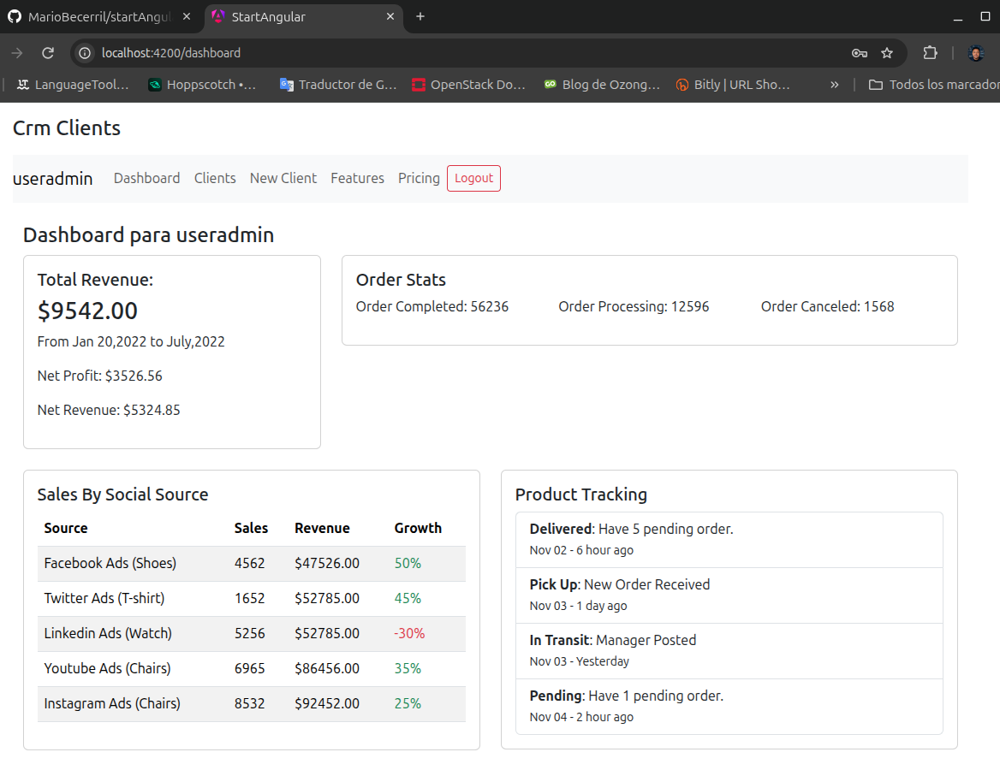
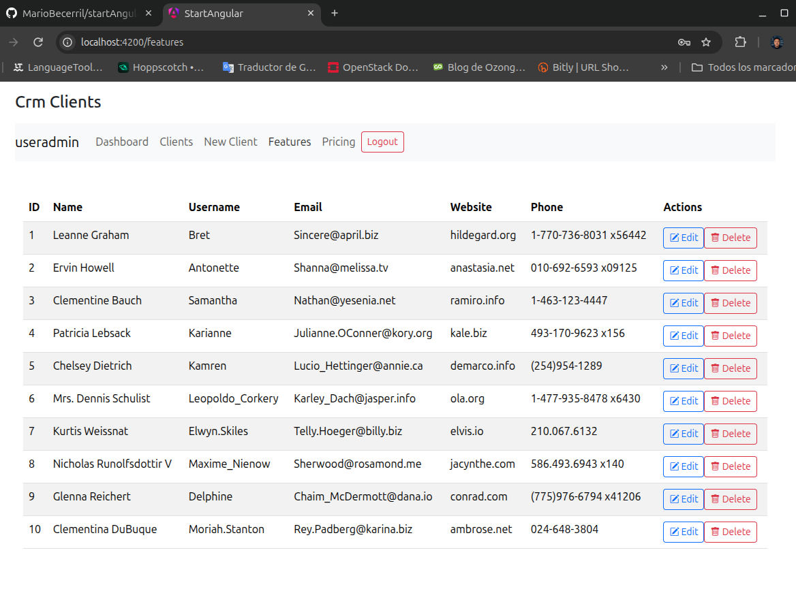
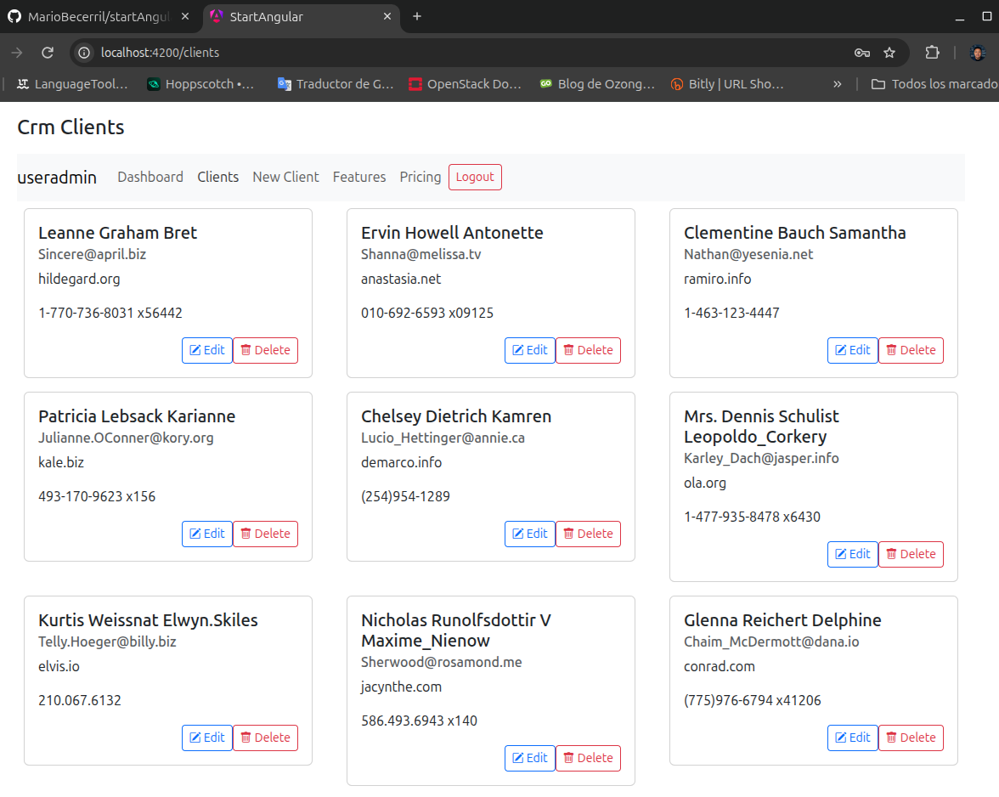

# 🧭 Panel de Administración - Angular

Este proyecto es un **panel de administración** desarrollado con **Angular**.
  Implementa funcionalidades de autenticación, autorización, manejo de sesiones, componentes standalone y un CRUD completo de clientes.
  Ideal como base para sistemas administrativos escalables.

## 📦 Repositorio

🔗 [GitHub - MarioBecerril/startAngular](https://github.com/MarioBecerril/startAngular)

---

## 🚀 Características Principales

- 🔐 **Autenticación y Autorización**  
  Uso de **Auth Guards** para proteger rutas privadas y gestión de sesiones con **tokens almacenados en localStorage**.

- 🧱 **Componentes Standalone**  
  Enfoque modular y reutilizable, facilitando el mantenimiento y la escalabilidad del proyecto.

- 📋 **CRUD de Clientes**  
  Funcionalidades completas de creación, lectura, actualización y eliminación, con validaciones de formularios incluidas.

- ✅ **Validaciones Reactivas**  
  Validaciones integradas para mejorar la experiencia de usuario y evitar errores en tiempo real.

- 💡 **Requisitos**  
  - Node.js: 18  
  - Angular CLI instalado globalmente  

- 👤 **Credenciales de Prueba**  
  - Usuario: `useradmin`  
  - Contraseña: `passadmin`

---

## 🛠️ Instalación y Configuración Local

Sigue estos pasos para correr el proyecto en tu máquina local:

1. **Clonar el repositorio**  
   ```bash
   git clone https://github.com/MarioBecerril/startAngular.git
   cd startAngular
   ```

2. **Instalar las dependencias**  
   ```bash
   npm install
   ```

3. **Iniciar el servidor de desarrollo**  
   ```bash
   ng serve
   ```

4. **Abrir en el navegador**  
   Dirígete a `http://localhost:4200`

---

## 📸 Capturas de pantalla

### Dashboard
Vista principal del panel tras iniciar sesión. Muestra métricas de negocio en tarjetas: ingresos totales, estadísticas de pedidos.

<p align="center">
  
</p>

### Listado de clientes
Vista tabular de clientes en la sección Features (`/features`). Incluye columnas de ID, nombre, usuario, email, sitio web y teléfono, con botones de editar y eliminar por fila.

<p align="center">
  
</p>

### Grid de clientes (Features)
Pantalla de clientes (`/clients`) con los registros en una cuadrícula de tarjetas. Cada tarjeta muestra nombre, email, sitio web y teléfono, junto con acciones de edición y eliminación.

<p align="center">
  
</p>

---
